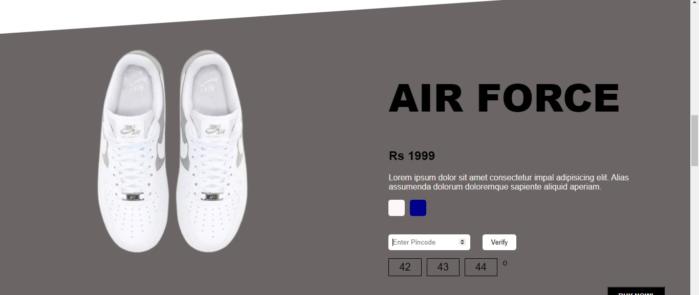

<!-- PROJECT LOGO -->
<br />
<div align="center">
    
  <p align="center">
    Team ALGOHUB
    <br />
    
  </p>
</div>

**Project Link - [Optimizinators][link]**

<!-- TABLE OF CONTENTS -->
<details>
  <summary>Table of Contents</summary>
  <ol>
    <li>
      <a href="#about-the-project">About The Project</a>
      <ul>
        <li><a href="#built-with">Built With</a></li>
      </ul>
    </li>
    <li>
      <a href="#getting-started">Getting Started</a>
      <ul>
        <li><a href="#prerequisites">Prerequisites</a></li>
        <li><a href="#installation">Installation</a></li>
      </ul>
    </li>
    <li><a href="#datasets">Datasets</a></li>
    <li><a href="#license">License</a></li>
    <li><a href="#contact">Contact</a></li>
  </ol>
</details>


<!-- ABOUT THE PROJECT -->
## About The Project

<div align="center">
    
</div>

<div align="center">
OptimiZinator is the culmination of simplicity and modularization while using minimal exorbitant resources. 
Its key attributes include a user-friendly client interface, a dynamic extensible backend, and smooth functionality. 
The best part is its ability to retrieve information rapidly.
However, its utility is not limited to speed, making use of bit packing it manages to compress huge datasets.
</div>
</br>

### Built With


Deployed on <br/>


<!-- GETTING STARTED -->
## Getting Started

  The following is a walkthrough to use our product locally.

### Prerequisites

This is an example of how to list things you need to use the software and how to install them.
*   Boost library
  ```sh
  sudo apt install libboost-all-dev
  ```

*   Curl
  ```sh
  sudo snap install curl
  ```
* CORS must be unblocked to access  the API from the website. This can be done in Google Chrome using the following extension [CORS UNBLOCK extension][ext]. The extension must be enabled while using the website.

### Installation

1. Clone the repo
   ```sh
   git clone https://github.com/KeiranHalkyon/matrixOpt.git
   ```
2. Install the prerequisites
3. Download one of the datasets given below and unzip it to any directory with read/write permissions enabled.</br>
&nbsp; (Keep a note of the directory)
4. Test only encoding and decoding - </br>
   Head over to the src and look for test.cpp</br>
   Edit the string 'fname' with the directory path of the downloaded dataset txt file</br>
   Compile test.cpp (may require the following argument -std=c++17) and execute it</br>
   Once encoded, the program will ask for an input - </br>
        Valid input ranges from 0 to (em.rows-1) (em is an object of type EncodedMatrix)</br>
		a vector will be returned where</br>
		If no seller at given index, returned value = -1</br>
		If all sellers are available at given index, returned value = -2</br>
		A vector of integers will be returned which contains uid of available sellers in ascending order</br>
5. Test using REST API - </br>
	Head over to Localhost_working_project/Files_for_rest_api_server/ and look for api_work_sample.cpp</br>
	On the 16th line where an EncodedMatrix object is initialized, provide the directory path of dataset txt file in the constructor</br>
	Compile the api_work_sample.cpp(the following arguments may be required : -std=c++17, -pthread)</br>
	Once encoded, the API can be tested using the following curl command from the same device</br>
   ```sh
    curl -X POST -d '<val>' "http://localhost:8080/api/data" -w "\ntime_starttransfer : %{time_starttransfer} s"
   ```
where 'val' will be replaced by the pincode</br>
	time_starttransfer indicates the time spent to receive the 1st byte, which indicates the actual response time of our API once hosted.   </br> 

## Datasets

Dataset with sparsity of</br>

 &nbsp; &nbsp;0.5  &nbsp; &nbsp; &nbsp; &nbsp; 0.3 &nbsp; &nbsp; &nbsp; &nbsp;0.1 </br>

<a href="https://drive.google.com/file/d/1CF0If61Vi-5I1ZyslovwHSjxtckbBDWK/view?usp=drive_link"></a> &nbsp; <a href="https://drive.google.com/file/d/1TQP38oW30FreRfSDMMyMXwYIjrK3ZczP/view?usp=drive_link"></a> &nbsp; <a href="https://drive.google.com/file/d/1V9cZZRMCu83M2SxKoRNo5oaH40XACjJj/view?usp=drive_link"></a>


<!-- LICENSE -->
## License

Distributed under the MIT License. See `LICENSE.txt` for more information.


<!-- CONTACT -->
## Contact

OptimiZinators has been developed for Build for Bharat by ONDC by

* Tanir Sahoo &nbsp; <a href="https://www.linkedin.com/in/tanir-sahoo-b0220b222/"></a> &nbsp; <a href="https://github.com/tanirsahoo"></br>
* Sukanya Manna &nbsp; <a href="https://www.linkedin.com/in/sukanya-manna/"></a> &nbsp; <a href="https://github.com/SM-2102"></br>
* Mriganka Manna &nbsp; <a href="https://www.linkedin.com/in/mriganka-manna-656b742b3/"></a> &nbsp; <a href="https://github.com/KeiranHalkyon"></br>
* Dyutiprovo Sarkar &nbsp; <a href="http://www.linkedin.com/in/dyutiprovo-sarkar-044384225"></a> &nbsp; <a href="https://github.com/Dyutiprovo"></br>

[link]: http://34.131.199.77
[ext]: https://chromewebstore.google.com/detail/cors-unblock/lfhmikememgdcahcdlaciloancbhjino
